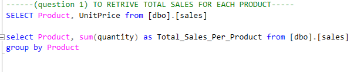

# LITA_CAPSTONE_PROJECT

# PROJECT TITLE: Sales Data Of A Retail Store

## Project Overview
This data analysis project aims to generate insight into the sales performance of a retail store over the past period of time, by analyzing top-selling products, regional performance and monthly sales trends. This project  analyze and drive insights to answer crucial questions and help the store make data driven decisions.
In the data recceived, we seek to gather enough insight to make resonable decisions which then enablle us to tell compelling stories around our data from the insight gotten and to know the best performance from our data
--------
## Tools Used
- Microsoft Excel [Download Here](https://www.microsoft.com)
 1. for Analysis
 2. For Visualization

- SQL
1. For Queries

 - Power BI
  1. For data cleaning
  2. For visualization

- GiftHub
1. For Documentation of Project
-------------- 
## Skills/concepts demonstrated
The following Power Bi features were incoporated by
- DAX Functions
- Quick Measures
- Filters
---------------
## Data Sourcing
This data (LITA_Capstone_Dataset) was gotten from LITA_Incubator LMS on CANVAS. it was then saved into my excel workbook before it was converted  into a **csv file** in-other for it to be imported into my SQL. on my Power BI, it was imported from my excel workbook.

It contains two sheets/tables

1. SalesData with 50,001 rows and 7 columns 
2. CustomerData with 75,001 rows and 8 columns
------------------
## Data Transformation/Cleaning:
Data was efficiently cleaned and transformed with **Power BI** . [a screenshot of applied steps] 
After scrutinizing all the columns, they were found to be valid and  devoid of empty cells and errors.

I created three more columns, all extracted from the OrderDate column. some of the applied steps included

- The first column contained months in date formamt and named Order Months
- Year was extracted from OrderDate for the second column, then i named it Order Year.
- The third column contained quarter which was in date format. I named it Quarter.

-----------------
## Exploratory Data Analysis
EDA involved the exploring of the data to answer some questions about the data such as;
- Top selling product
- Regional Performance
- Monthly Sales Trends
-------------------
## Project Objective
This Project was designed to address the following analysis goals:
- Sales Transaction in Each Region

- Highest Selling Product By Total Sales Values
- Total Revenue Per Product
- Monthly Sales Total For The Current Year
- Top Five Customers by Total Purchase Amount
- Percentage Of Total Sales Contributed By Each Region
- Product With No Sales In Last Quarter
----------------
## Problem Statement
- Which of our Products makes the greatest profit and which product runs the store into loss
- What is the total sales made yearly since 2023? Has sales been on the increase since over the years?
- Which Region Has the Highest sales and Which Region has the lowest sales
-------------
## Data Analysis 
This is were we included some basic lines of code or queries or even some of the DAX expressions used during analysis
``` SQL
- select Region, count(CustomerID) as no_of_Customers from [dbo].[customer]
group by Region
```
----------
## Data Visualizations

--------
## Conclusions & Recommendations
- in conclusion The highest selling product is shoes while the lowest selling product is socks.
-  The region making the most sales in the retail store is south and the region making the lowest sales is west
- A total of 345,000 product was sold with a net worth of 1 million.
  
